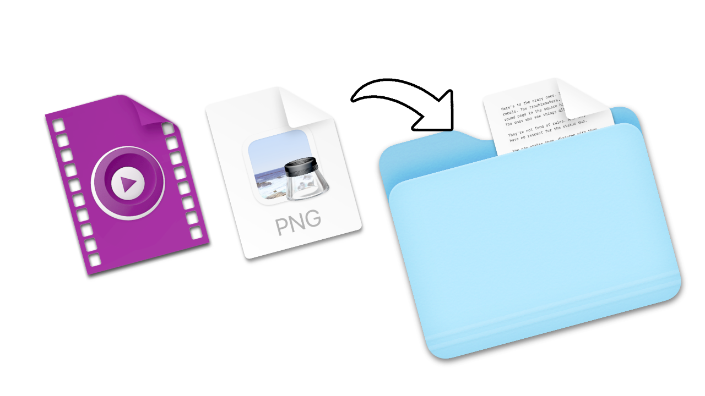

# file-organizer



Organize your downloaded files into categorical folders as they are downloaded.

This package was made to be used on macOS machines using Automator and Folder Actions.

## Installation/Setup

### Clone the Repository
```
git clone https://github.com/derektata/file-organizer-go.git
cd file-organizer-go
```

### Using Make (non-Nix users)
```
make
```

### Nix users
If you are using Nix, you can build and run the project using the Nix flake.

#### Build and Run
```
nix build
./result/bin/file-organizer -h
```

#### Development Shell
You can also enter a development shell with all necessary dependencies:
```
nix develop
```

## Usage
```
Usage of file-organizer:
  -c, --config string      The path to the configuration file (default "~/.config/file-organizer/config.json")
  -d, --directory string   Path to organize files
      --dry-run            Perform a dry run without moving files
      --prepend-date       Prepend the current date to the file name
```

## License

MIT License
